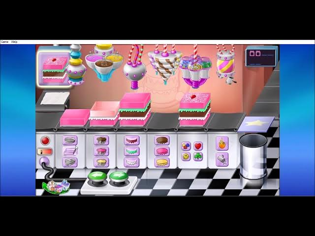

### Comfy Cakes Game
Comfy Cakes is a baking game where players assemble cakes to match customer orders. Inspired by the Comfy Cakes game from Purble Place, the player selects shape, frosting, and toppings under time pressure. The goal is to build correct cakes and score points.

#### Inspiration from Purble Place’s original Comfy Cakes mini‑game”


#### Features 
- Cute, colorful cake-building interface
- Randomly generated customer orders
- Accuracy-based scoring
- Increasing difficulty with faster-paced rounds
- Clickable buttons for cake selection (shape, frosting, topping)
- Visual feedback when you complete an order

#### Installation

Clone this repository and install required dependencies:

```bash
pip install -r requirements.txt
```
This game uses:
- pygame (main game library)
If you don't have pygame installed:
```
pip install pygame
```

#### Usage
To run the game:
```
python Barbara_Fengler_comfycakes.py
```
Make sure all related files (e.g., order_generator.py, button.py, etc.) are in the same folder. Assets like images or sounds should go in the media/ folder.
---

#### Project Structure

```
Barbara_Fengler_comfycakes/
├── comfy_cakes.py           # Main game file
├── order_generator.py       # Logic for randomizing customer orders
├── button.py                # Reusable button class for UI
├── media/                   # Images, sounds, fonts
│   ├── cake_shapes/
│   ├── toppings/
│   ├── frosting_colors/
├── .gitignore
├── README.md
├── requirements.txt
└── documentation.pdf        # Final project documentation
```

#### Visual Preview

----------------------------------------------------
|     Order: 💜 purple heart cake with sprinkles     |
----------------------------------------------------
[Shape] → [Frosting] → [Topping] → [Done! ✔️]

   ❤️        💗           🍓         ✔️ Click
   ⬆️         ⬆️            ⬆️
   ⬇️         ⬇️            ⬇️
   🔘         🔘            🔘

#### License 
MIT License — feel free to use or adapt this project with credit.

#### Acknowledgements 
Inspired by *Comfy Cakes* from the Purble Place suite
Created as a final project for Technical Basics I